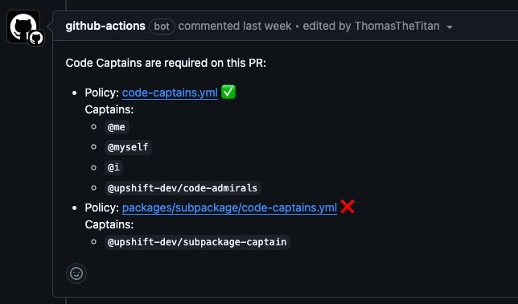

# Documentation

### Concepts

<b>What is a code captain?</b>

A code captain is an "owner" of a part of the codebase. In GitHub, codeowners are typically used for strict review requirements.

We think this definition can be too strict at times. We believe that code ownership is a spectrum, and that it can be important to have a clear understanding of who to consult with when making changes to a part of the codebase without strictly requiring their review.

We're excited to introduce a way for dev teams to capture the mapping between the who and the what of their codebase.

Right now, we're replacing codeowners with a more controllable and flexible system based on the captains system. In the future, we'd like to also provide integrations with other tools your dev team may use to help with workflows like:

-   incident routing
-   support ticket routing
-   dev onboarding

<b>What does a captains file look like?</b>

It is always named `code-captains.yml`, and you can put as many as you want anywhere in your repo. Here's an example:

```yaml
version: 1
policies:
    - include: # A list of files to include in this policy
          - package.json
          - tsconfig.json
      captains: # Who is responsible for these files
          - "@frontend-infra"
    - include:
          - .gitignore
      captains:
          - "@git-experts"
```

The exact spec is as follows:

-   `version`: Always set to 1 right now, but let's us easily support backwards-compatible changes and handle migrations.
-   `policies`: A list of policies that define which files are covered by the policy and who the captains are.
    -   `include` (default: `all-files`): A list of file patterns that are covered by this policy.
    -   `exclude` (default: `none`): A list of file patterns that are excluded from this policy.
    -   `captains`: A list of GitHub usernames/team names that are responsible for the files covered by this policy.
        Team names should follow the format `@<org>/<team_slug>`.
        If you plan to use team names, see the Usage&rarr;Inputs section below to configure a token for the action.

### Installation

<b>Defining code captains</b>

To get started with captains in your repo, you can define captains files anywhere in your repo.

> [!TIP]
> We recommend putting them as deep in your folder structure as they can go. This helps other devs understand the scope of the policies.

<b>Migrating from CODEOWNERS</b>

For your convenience, we provide a migration tool that will convert your CODEOWNERS file to a captains file.

You can run:

```bash
npx @upshift-dev/code-captains-migrator migrate [path-to-codeowners-file]
```

If you exclude the file path, the default path is `./CODEOWNERS`.

Optionally, you can also provide a `-d` flag to have the migrator try to maximize how deep each captains file is placed in your repo.

### Usage

To use the captains files, we distribute a Github action which understands how to read filepaths and determine who the captains are.

```yaml
- name: Determine code captains
  id: code-captains
  uses: upshift-dev/code-captains@1.0.2
  with:
      changed-files: <json-string-array-of-file-paths>
```

<b>Inputs:</b>

-   `changed-files`: JSON string array of file paths that have changed in the PR.
-   `token` (default: `GITHUB_TOKEN`): Must be overridden if using team-based captains.
    This token is used to check PR approvers and team membership. The token used by default does not have access to the `org:read` scope.
    To use this, set up a token and follow best practices for
    [using secrets in GitHub Actions](https://docs.github.com/en/actions/security-for-github-actions/security-guides/using-secrets-in-github-actions).
    This token will need the `org:read` and `pull_requests:write` scopes.

<b>Outputs:</b>

-   `metPolicies`: array of policy matches
    -   `policyFilePath`: path to the policy file that was matched
    -   `captains`: array of captains that matched the policy
    -   `matchingFiles`: array of files that matched the policy include/exclude filters
    -   `isPolicySatisfied`: boolean whether PR approvers satisfy the policy
-   `areAllPoliciesSatisfied`: boolean, whether all `metPolicies` are satisfied

We also ship a re-usable workflow that you can use specifically for what we see the main use case being right now: helping PR authors understand who the captains are for the files they changed.

```yaml
name: Check Code Captains

on:
    pull_request:
    pull_request_review:
        types: [submitted]

jobs:
    check-code-captains:
        uses: upshift-dev/code-captains/.github/workflows/code-captains-workflow.yml@1.0.2
        token: ${{ secrets.CODE_CAPTAINS_TOKEN }} # If using team-based captains
```

This will produce comments that look like this:



The final step in the workflow will fail if the code captains policies have not been satisfied by the reviewers.
You can make this check required to strictly enforce code captains.

> [!TIP]
> You can choose if you want the comments to tag the captains or not.
> You may not want notifications on because you notification volume can be overwhelming for certain codeowner workflows.
>
> See this [discussion](https://github.com/orgs/community/discussions/35673) for inspiration on this decision.
