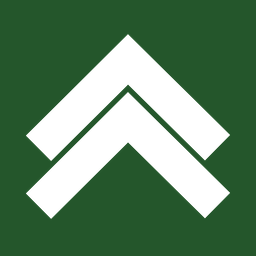
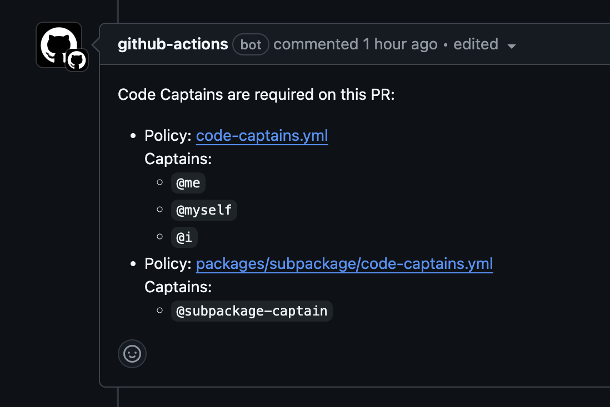

# <div style="width: 100%; display: flex; justify-content: center; align-items: center; gap: 12px;"> Upshift</div>

A codebase management tool for engineering teams.

<h3>What's included</h3>

-   Replacement for CODEOWNERS that's more configurable.
-   Github actions to enforce codebase rules.
-   Migration tool to convert CODEOWNERS to Upshift.
-   (soon) Integration into more tools like Jira, Linear, PagerDuty, Slack.

<h3>Getting started</h3>

For the full documentation, see the [docs page](/DOCUMENTATION.md).

Here's some YAML you can use to get started straight away:

```yaml
- name: Checkout all code-captains.yml files on target branch
  uses: actions/checkout@v4
  with:
      ref: ${{ github.base_ref }}
      sparse-checkout: code-captains.yml
      sparse-checkout-cone-mode: false

- name: Determine changed files
  id: changed-files
  uses: tj-actions/changed-files@v45
  with:
      escape_json: false
      json: true

- name: Determine Code Captains
  id: code-captains
  uses: upshift-dev/code-captains@1.0.1
  with:
      changed-files: ${{ steps.changed-files.outputs.all_changed_files }}
```

From there, you can access the outputs of the Github action to determine who the code captains are for the files that have changed.

<b>Outputs:</b>

-   `metPolicies`: array of policy matches
    -   `policyFilePath`: path to the policy file that was matched
    -   `captains`: array of captains that matched the policy
    -   `matchingFiles`: array of files that matched the policy include/exclude filters
    -   `isPolicySatisfied`: boolean whether PR approvers satisfy the policy
-   `areAllPoliciesSatisfied`: boolean, whether all `metPolicies` are satisfied

We also ship a re-usable workflow that you can use to help PR authors understand which captains they probably need to get approval from or consult with.

```yaml
name: Check Code Captains

on:
    pull_request:
    pull_request_review:
        types: [submitted]

jobs:
    check-code-captains:
        uses: upshift-dev/code-captains/.github/workflows/code-captains-workflow.yml@1.0.1
```

This will produce comments that look like this:



> [!TIP]
> You can choose if you want the comments to tag the folks or not.
> You may not want notifications on because you notification volume can be overwhelming for certain codeowner workflows.
>
> See this [discussion](https://github.com/orgs/community/discussions/35673) for inspiration on this decision.

<h3>Why did we build this</h3>

As engineering leads, we've seen how eng teams can get bogged down once they have >8 people trying to work in the same repo.

We've also seen a growing trend of using monorepos and recoiling from microservice architectures.

We believe that eng teams need better codebase management tooling for these more modern approaches to collaborating on building awesome software.

<hr />

Built with ❤️ by the [Upshift](https://upshift.dev) team.
